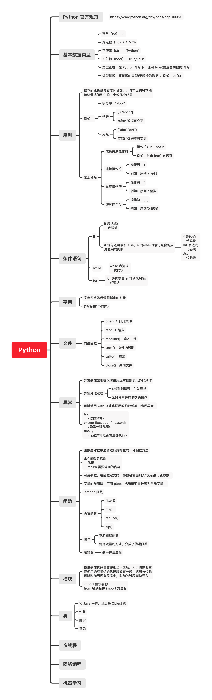

rc-cluster-python

```
rc-cluster-python/
    ├── basics/         # python 基础语法相关
    ├── network/        # python 网络相关
    ├── standard/       # python 提供的标准库
    ├── zodiac/         # 输入时间获取星座的示例
    └── README.md
```

